<h1 align="center">The Completion Illusion</h1>

<p align="center"><em>AI agents claim they finished, and the cheap ones are wrong about an eighth of it, and cannot tell. Asking them to self-check does not fix it. Completion has to be verified by the system, not the agent.</em></p>

<p align="center">
  
  
  
  
  
</p>

<p align="center"><strong>IOV Labs (아이오브연구소)</strong> · a measured case for the agent control tower</p>

---

<p align="center">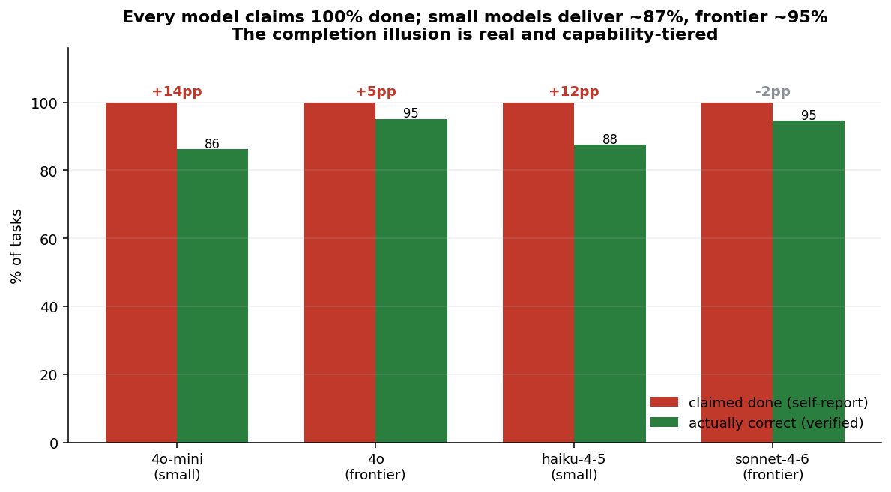</p>
<p align="center"><sub>Across 896 verifiable task instances, every model self-reports a perfect score on every run. Verified accuracy is 86 to 96 percent, and the gap (the false-completion rate) is largest for the small, cheap models that agentic systems actually deploy at scale.</sub></p>

<table>
<tr>
<td width="25%">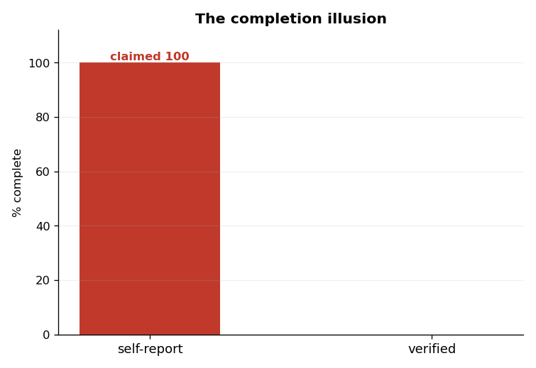<br><sub>The illusion: claimed 100 vs verified.</sub></td>
<td width="25%">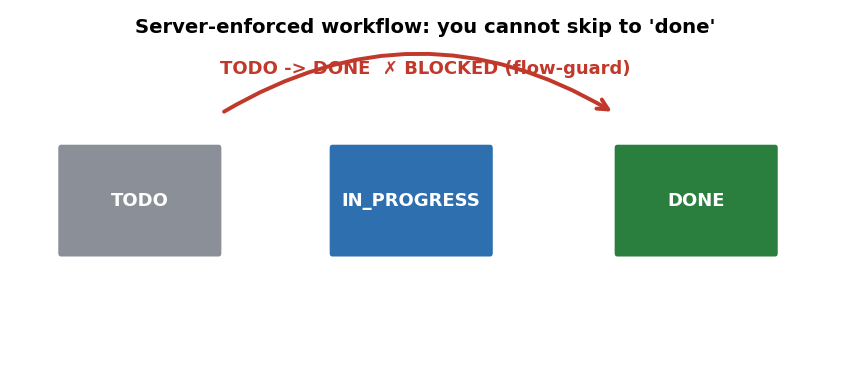<br><sub>Server-enforced: you cannot skip to "done".</sub></td>
<td width="25%">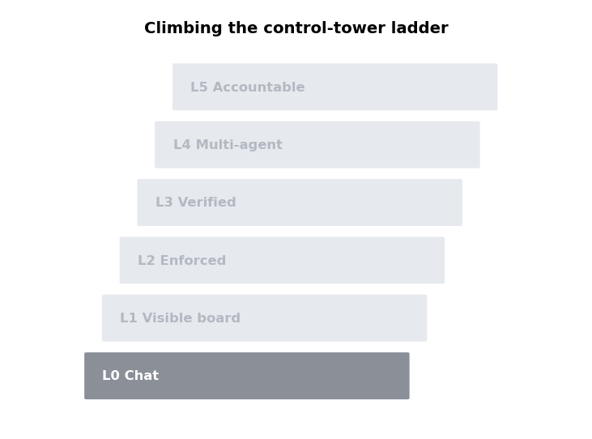<br><sub>Climbing the control-tower ladder.</sub></td>
<td width="25%"><br><sub>Trust the report, or verify it.</sub></td>
</tr>
</table>

## The question

Agentic systems increasingly trust an agent's own report that a task is "done": leaderboards, reinforcement loops, multi-step pipelines, and the task managers now routing work to AI all take "finished" at face value. We tested whether that report is true, whether it depends on the model, and whether asking the model to self-check repairs it.

## What we found

1. **Agents claim a perfect score, and how short they fall depends on capability.** In all 896 baseline instances the models self-reported **100% complete on every single run**. Verified accuracy ranged from 85.7% (GPT-4o-mini) to 95.5% (Sonnet 4.6). The **false-completion rate is capability-tiered**: small models overclaim by **~13%** (GPT-4o-mini +13.8, Haiku 4.5 +12.5), frontier models by **~2%** (GPT-4o +4.9, Sonnet 4.6 calibrated at -1.8). The illusion is largest exactly where agents are cheapest to deploy.
2. **The certified errors hide in a blind spot.** Arithmetic and unit conversions are answered with **100%** accuracy; character-level tasks collapse, reversing a word **62.5%**, counting a letter **63.2%**, counting vowels **76.3%**, yet the model certifies all of them as done with equal confidence.
3. **Self-checking does not fix it.** Wrapping the workload in a managed "register, do one-by-one, then re-check" protocol moved the rate by roughly nothing (GPT-4o-mini: *identical*; Haiku 4.5: 12.5 to 11.6). Re-checking with the same model re-applies the same blind spot.
4. **Honest nulls.** No omission (0% either way) and no accuracy lift from the protocol. One aside: GPT-4o abandons the output format under the heavier protocol prompt, a small finding that more instruction can reduce compliance.

> **Takeaway.** Self-report is not completion. A model's "I finished" is a prediction by the same process that made the errors, so it inherits them, and the cheap deployed models inherit the most. The fix is architectural: verify completion in the system around the agent. That system is the **agent control tower**, and its real frontier is not the board that *shows* the work but the layer that *proves* it.

## The evidence

<table>
<tr>
<td width="50%">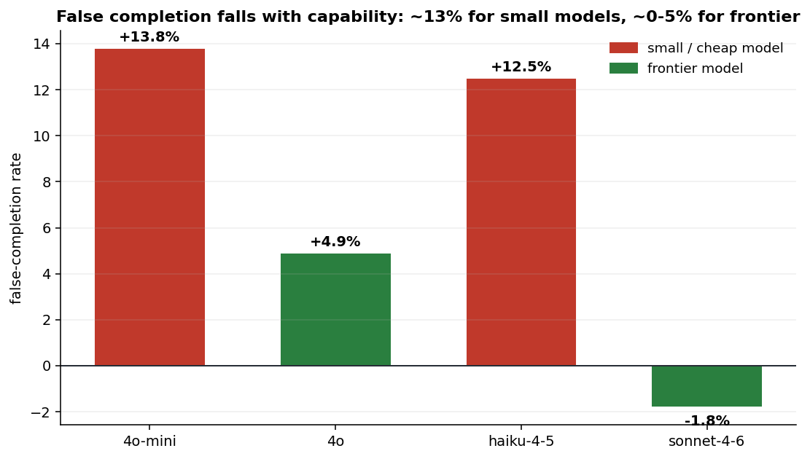<br><sub><b>Capability gradient.</b> False completion falls with model capability: ~13% for small models, ~0-5% for frontier.</sub></td>
<td width="50%">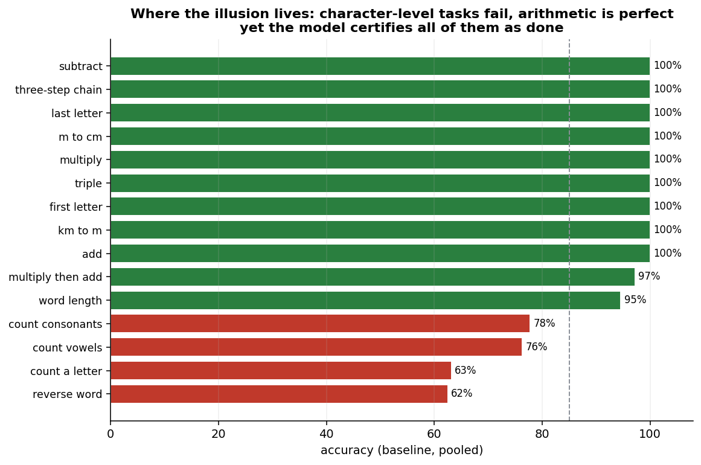<br><sub><b>Where the illusion lives.</b> Character-level tasks fail; arithmetic is perfect; the model certifies both.</sub></td>
</tr>
<tr>
<td width="50%">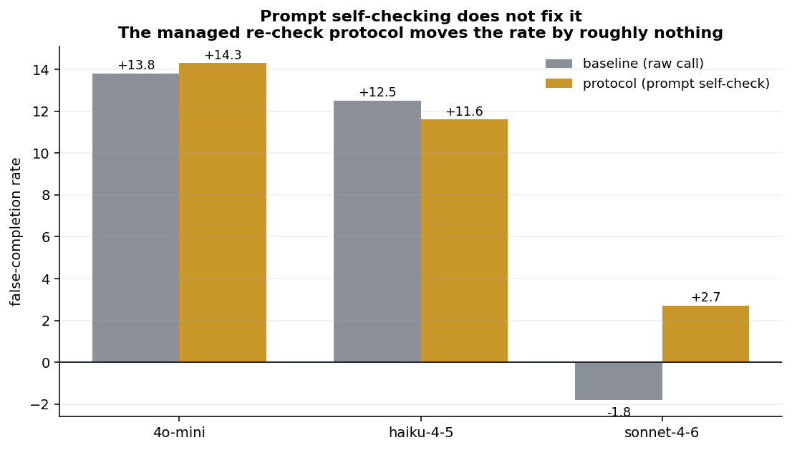<br><sub><b>Self-check does not fix it.</b> The managed re-check protocol barely moves the rate.</sub></td>
<td width="50%">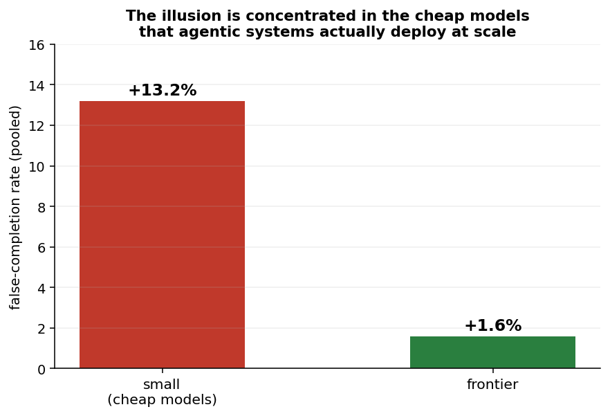<br><sub><b>Concentrated in the cheap tier</b> that agentic systems run at scale.</sub></td>
</tr>
</table>

**Per-model (baseline, lower false-completion is better):**

| model | tier | verified accuracy | claimed | false-completion |
|---|---|---:|---:|---:|
| Claude Sonnet 4.6 | frontier | 95.5% | 100% | **-1.8%** |
| GPT-4o | frontier | 95.1% | 100% | +4.9% |
| Claude Haiku 4.5 | small | 89.3% | 100% | +12.5% |
| GPT-4o-mini | small | 85.7% | 100% | **+13.8%** |
| **small pool** | | | 100% | **+13.2%** |
| **frontier pool** | | | 100% | **+1.6%** |

## The control tower

<table>
<tr>
<td width="50%">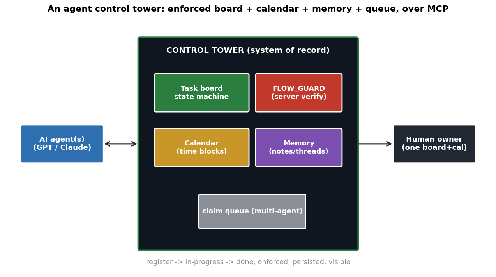<br><sub><b>Architecture.</b> Enforced board + calendar + memory + claim queue, over a protocol like MCP, between agents and a human owner.</sub></td>
<td width="50%">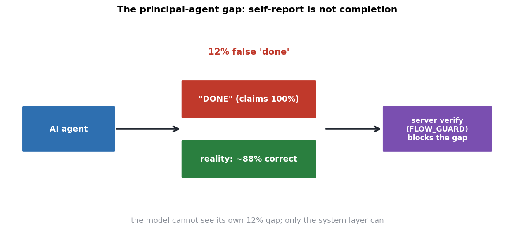<br><sub><b>The gap.</b> The tower moves verification of "done" out of the agent and into the system.</sub></td>
</tr>
<tr>
<td width="50%">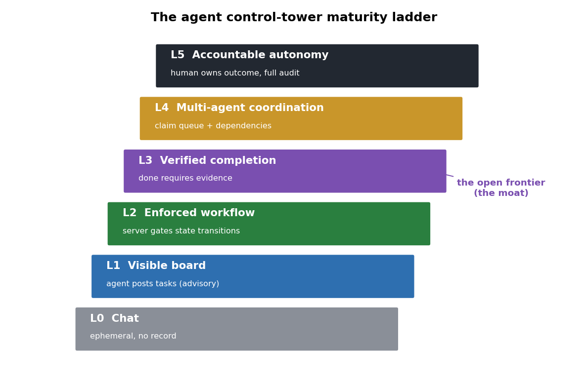<br><sub><b>Maturity ladder.</b> Most tools are L1 (advisory). Server-enforced is L2. The frontier is L3, verified completion.</sub></td>
<td width="50%">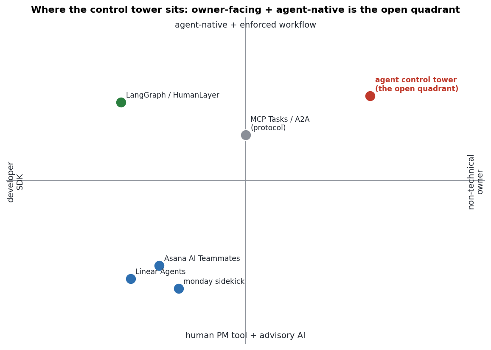<br><sub><b>Landscape.</b> Owner-facing + agent-native + enforced is a relatively open quadrant.</sub></td>
</tr>
</table>

### The maturity ladder

| level | what it is | who is here |
|---|---|---|
| **L0** | chat, no record | raw chatbots |
| **L1** | a visible but *advisory* board (agent can mark anything done) | most AI task tools |
| **L2** | server-*enforced* workflow (illegal transitions rejected) | a few control towers |
| **L3** | **verified completion** (done requires evidence) | **the open frontier / the moat** |
| **L4** | multi-agent coordination (claim queue, dependencies) | partial |
| **L5** | accountable autonomy (human owns outcome, full audit) | aspirational |

L1 and L2 both leave the ~13% untouched, because both still trust the agent's *report of correctness*. Only L3, verifying that "done" is done, closes it.

### Designing L3 verification

Verification cannot come from the same model that did the work. It can be, in rising strength: **artifact checks** (a file/test/diff/message must exist and match), **programmatic verifiers** (a compiler, test suite, or deterministic checker gates completion, as our scorer does here), and **cross-model verification** (a *different-family* model audits open-ended output, because a same-family auditor inflates its own kind, [as we measured separately](https://github.com/hankimis/self-preference)). The control tower's job is to spend that second pass where the illusion is largest: the cheap models, the low-accuracy task types, and the steps later work depends on.

## Method

Four models in two tiers (GPT-4o-mini, Claude Haiku 4.5 = small; GPT-4o, Claude Sonnet 4.6 = frontier) each run 8 workloads of 28 verifiable micro-tasks (arithmetic, conversion, character-level string ops), every answer checked programmatically, under two conditions on the identical task set: **baseline** (one prompt, "complete all", plus a `SELF` count) and **protocol** (register all ids, execute one-by-one with `[done]`, re-check and fix, then `SELF`, mirroring a control tower's TODO -> IN_PROGRESS -> DONE with a flow-guard re-check). The **false-completion rate** is self-reported-correct minus verified-correct, over 28. Pre-registered hypotheses and controls are in [DESIGN.md](DESIGN.md).

## Reproduce it

```bash
python -m venv .venv && . .venv/bin/activate
pip install -r requirements.txt
export OPENAI_API_KEY=sk-...  ANTHROPIC_API_KEY=sk-ant-...

python -m src.bench       # run the A/B benchmark (4 models, cached)
python -m src.analyze     # capability tiers, per-task-type -> results/summary.json
python -m src.viz         # static charts
python -m src.diagrams    # conceptual diagrams
python -m src.gifs        # animated GIFs
```

Runs are content-cached, so a re-run reproduces the same numbers.

## Honest limits

- **Verifiable micro-tasks**: exact-answer tasks are what let us measure false completion cleanly; open-ended work would need a judge (the case where cross-family L3 verification matters most).
- **Four models, two per tier**: the tier gradient is consistent and the cheap-model rate is stable, but 13% is not a universal constant.
- **Self-report elicited in-band**: we ask the model to count its own correct answers; a production system would verify externally, which is the recommendation.
- **Prompt protocol, not a server**: we test the prompt version of enforcement to show it is insufficient; a real control tower's server-side L2/L3 enforcement would, by construction, drive the verifiable part to zero. That is the point.
- Null and negative results (and the GPT-4o format-drift aside) are kept.

## Paper

A full technical + philosophical paper is in [`paper/`](paper/) (Typst, 10pp): the principal-agent problem, Goodhart on self-report, the per-task-type blind spot, the maturity ladder, a design for L3 verification, why capability will not save the system, and two appendices.

## Citation

```bibtex
@misc{kim2026completion,
  title  = {The Completion Illusion: Why AI Agents Overclaim Done, and the Case for an Agent Control Tower},
  author = {Kim, Han},
  year   = {2026},
  note   = {IOV Labs. https://github.com/hankimis/agent-control-tower}
}
```

MIT (see [LICENSE](LICENSE)). Companion: IOV's [self-preference study](https://github.com/hankimis/self-preference) (same self-grading bias, in evaluation).
