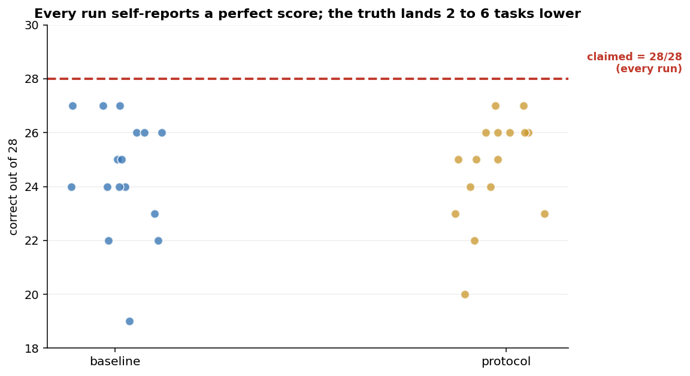
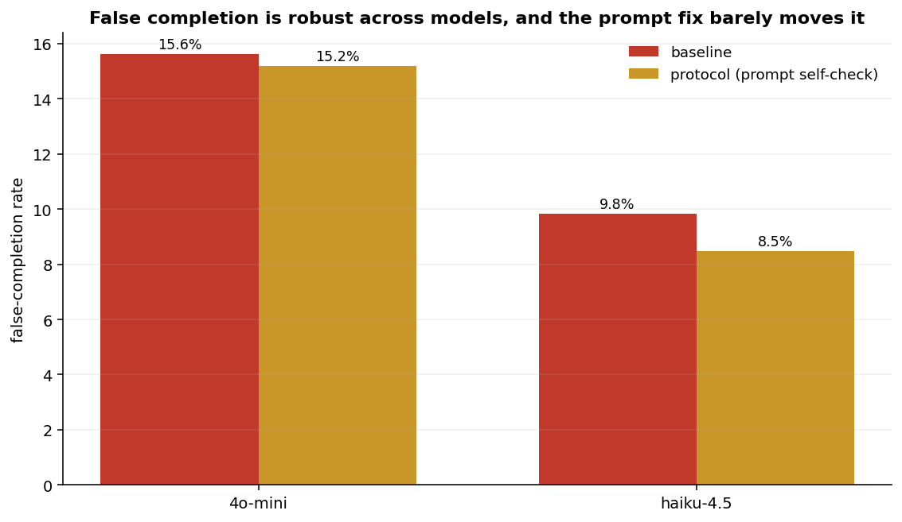
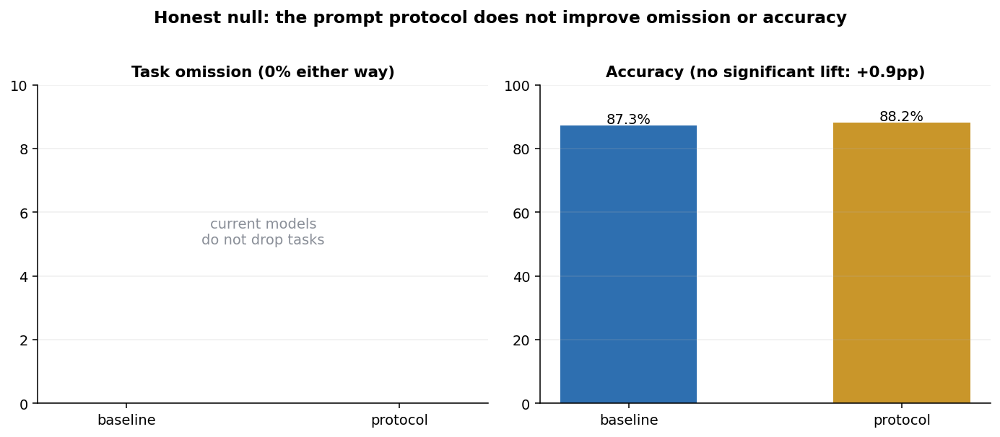
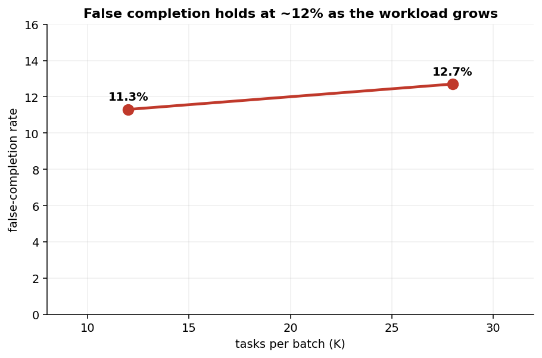

<h1 align="center">The Completion Illusion</h1>

<p align="center"><em>AI agents claim they finished, deliver about 88%, and cannot tell the difference. Asking them to self-check does not fix it. Completion has to be verified by the system, not the agent.</em></p>

<p align="center">
  
  
  
  
  
</p>

<p align="center"><strong>IOV Labs (아이오브연구소)</strong> · a measured case for the agent control tower</p>

---

<p align="center"></p>
<p align="center"><sub>Pooled over two models and 896 verifiable task instances: the agent claims 100% done, verified accuracy is ~88%, and a prompt-level self-check does not close the 12-point gap.</sub></p>

<table>
<tr>
<td width="25%"><br><sub>The illusion: claimed 100 vs actual 88.</sub></td>
<td width="25%"><br><sub>Server-enforced workflow: you cannot skip to "done".</sub></td>
<td width="25%"><br><sub>Climbing the control-tower maturity ladder.</sub></td>
<td width="25%"><br><sub>Trust the report, or verify it.</sub></td>
</tr>
</table>

## The question

Agentic systems increasingly trust an agent's own report that a task is "done." We tested whether that report is true, and whether asking the model to self-check repairs it. It is not, and it does not.

## What we found

1. **Agents claim a perfect score and deliver ~88%.** Across 896 verifiable micro-task instances (two models), the agent self-reported a perfect score on **every single run**, while verified accuracy was 87.3%. The **false-completion rate is 12.7%**: an eighth of every "done" was not in fact correct, and the model could not tell.
2. **Self-checking does not fix it.** Wrapping the identical workload in a managed "register, do one-by-one, then re-check" protocol, the kind of self-verification a model is told to perform, moved the rate only to **11.8%**. Re-checking with the same model re-applies the same blind spot.
3. **Honest null: no free accuracy.** The protocol did **not** improve omission (0% either way) or accuracy (+0.9 points, not significant). The board's value is not that it makes the model smarter.

> **Takeaway.** Self-report is not completion. A model's "I finished" is a prediction by the same process that made the errors, so it inherits them. The fix is architectural: verify completion in the system around the agent. That system is the **agent control tower**, and its real frontier is not the board that *shows* the work but the layer that *proves* it.

## The control tower

<table>
<tr>
<td width="50%"><br><sub><b>Architecture.</b> Enforced board + calendar + memory + claim queue, over a protocol like MCP, between agents and a human owner.</sub></td>
<td width="50%"><br><sub><b>The gap.</b> The tower moves verification of "done" out of the agent and into the system.</sub></td>
</tr>
<tr>
<td width="50%"><br><sub><b>Maturity ladder.</b> Most tools are L1 (advisory). Server-enforced is L2. The frontier is L3, verified completion.</sub></td>
<td width="50%"><br><sub><b>Landscape.</b> Owner-facing + agent-native + enforced is a relatively open quadrant.</sub></td>
</tr>
</table>

## The evidence

<table>
<tr>
<td width="33%"><br><sub>Every run reports the max; the truth lands 2 to 6 lower.</sub></td>
<td width="33%"><br><sub>Robust across models; the prompt fix barely moves it.</sub></td>
<td width="33%"><br><sub>The honest null: no omission or accuracy lift.</sub></td>
</tr>
</table>

<p align="center"></p>
<p align="center"><sub>False completion holds near 12% as the workload grows from 12 to 28 tasks.</sub></p>

## Method

Two models each run 8 workloads of K verifiable micro-tasks (arithmetic, string ops, multi-step), every answer checked programmatically, under two conditions on the identical task set: **baseline** (one prompt, "complete all", plus a self-report) and **protocol** (register all ids, execute one-by-one with `[done]`, re-check and fix, then self-report, mirroring a control tower's TODO -> IN_PROGRESS -> DONE with a flow-guard re-check). Run at K=12 and K=28. The **false-completion rate** is self-reported-correct minus verified-correct, over K. Pre-registered hypotheses and controls are in [DESIGN.md](DESIGN.md).

## Reproduce it

```bash
python -m venv .venv && . .venv/bin/activate
pip install -r requirements.txt
export OPENAI_API_KEY=sk-...  ANTHROPIC_API_KEY=sk-ant-...

python -m src.bench       # run the A/B benchmark (cached)
python -m src.viz         # static charts
python -m src.diagrams    # conceptual diagrams
python -m src.gifs        # animated GIFs
```

Runs are content-cached, so a re-run reproduces the same numbers.

## Honest limits

- **Verifiable micro-tasks**: exact-answer tasks are what let us measure false completion cleanly; open-ended work would need a judge and inherit judge bias.
- **Two models, one per tier**: the 12% is stable across them and across batch size, but is not a universal constant.
- **Prompt protocol, not a real server**: we test the prompt version of enforcement to show it is insufficient; a production control tower's server-side L2/L3 enforcement would, by construction, drive the verifiable part to zero. That is the point.
- Null and negative results are kept.

## Paper

A full technical + philosophical paper is in [`paper/`](paper/) (Typst), covering the principal-agent problem, Goodhart on self-report, the maturity ladder, and why verification requires the other.

## Citation

```bibtex
@misc{kim2026completion,
  title  = {The Completion Illusion: Why AI Agents Overclaim Done, and the Case for an Agent Control Tower},
  author = {Kim, Han},
  year   = {2026},
  note   = {IOV Labs. https://github.com/hankimis/agent-control-tower}
}
```

MIT (see [LICENSE](LICENSE)).
